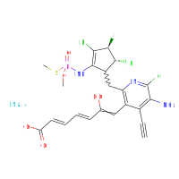

Graphmol.jl
===================================================

**Graphmol.jl** is a graph-based molecule modeling library written in Julia. This is a re-implementation of [Chorus](https://github.com/mojaie/chorus).


Installation
-------------

```
 (v1.0) pkg> add GraphMol
```


Usage
-------------

Try examples and tutorials in the [notebook directory](./notebook)


Features
----------

- Structure image export (SVG)
  

- Import from/export to .sdf, .mol
- Molecular property calculation (MW, Chemical formula)
- Descriptors

  - H-bond donor/acceptor
  - Wildman-Crippen logP
  - Aromaticity

- Molecule graph topology (ring, scaffold, connectivity)
- Sub(super)structure search
- MCS with diameter restriction (MCS-DR) and graph-based local similarity (GLS)


License
-------------

[MIT license](http://opensource.org/licenses/MIT)


Copyright
--------------

(C) 2018 Seiji Matsuoka
