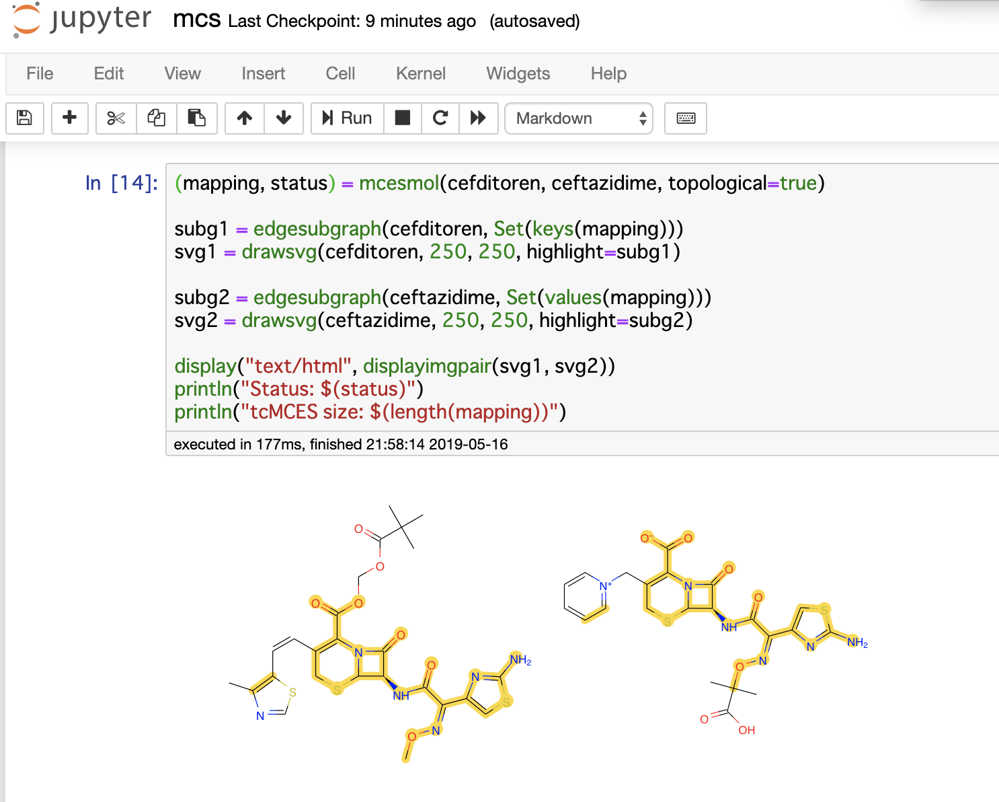
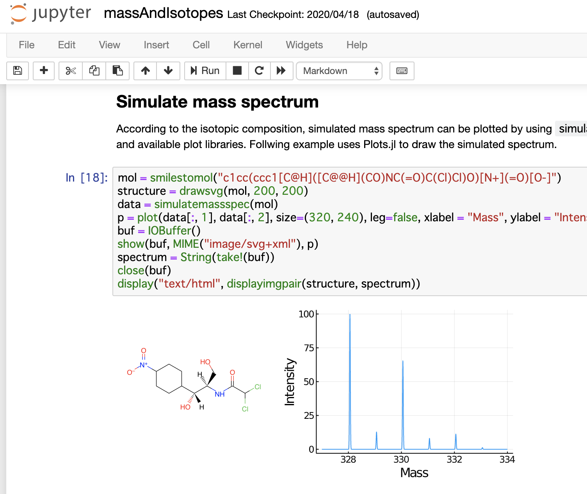

MolecularGraph.jl
===================================================

**MolecularGraph.jl** is a graph-based molecule modeling and chemoinformatics analysis toolkit fully implemented in Julia.

## Usage

- [Try it with Jupyter notebook tutorials](https://github.com/mojaie/MolecularGraph.jl_notebook)
- [Documentation and API Reference](https://mojaie.github.io/MolecularGraph.jl/dev)

## Features

- Chemical structure file I/O
  - Structure image drawing and export to SVG
  - SDFile import/export (.sdf, .mol)
  - SMILES/SMARTS parser

- Basic descriptors
  - H-bond donor/acceptor
  - rotatable bonds
  - Aromaticity
  - Wildman-Crippen logP

- Atomic mass
  - standard atomic/molecular weight
  - relative atomic/molecular mass
  - isotopic composition

- Molecular graph topology
  - Ring, scaffold, connectivity
  - Graph traversal

- 2D geometry
  - Stereochemistry drawing
  - Coordinates generation ([coordgenlibs](https://github.com/schrodinger/coordgenlibs))

- Sub(super)structure
  - Library search by using SMARTS query
  - Subgraph isomorphism detection with VF2 algorithm
  - Node-induced and edge-induced
  - Constraints (mandatory/forbidden mapping)

- SMARTS and terminology graph-based functional group analysis

- Maximum common substructure (MCS)
  - By clique detection algorithm
  - Node-induced (MCIS) and edge-induced (MCES)
  - Connected and disconnected
  - Topological constraint (known as tdMCS)
  - Diameter restriction (MCS-DR) and graph-based local similarity (GLS)

## License

[MIT license](http://opensource.org/licenses/MIT)

## Copyright

(C) 2018-2020 Seiji Matsuoka
