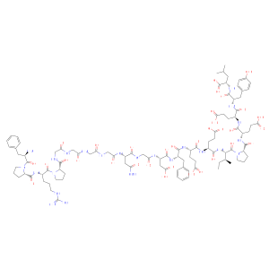
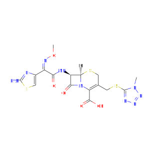
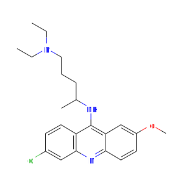
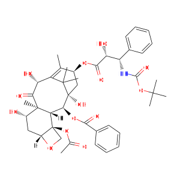
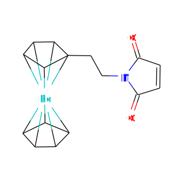

Graphmol.jl
===================================================

**Graphmol.jl** is a graph-based molecule modeling library written in Julia.


Installation
-------------

```
 (v1.0) pkg> add GraphMol
```


Usage
-------------

Try examples and tutorials in the [notebook directory](./notebook)


Features
----------



- Structure image export (SVG)

- SDFile import/export (.sdf, .mol)

- SMILES/SMARTS parser

- Basic descriptors
  - molecular weight, composition and formula
  - H-bond donor/acceptor
  - rotatable bonds
  - Aromaticity
  - Wildman-Crippen logP


- Molecule graph topology (ring, scaffold, connectivity)

- Sub(super)structure search
  - VF2 algorithm based subgraph isomorphism


- MCS with diameter restriction (MCS-DR) and graph-based local similarity (GLS)


License
-------------

[MIT license](http://opensource.org/licenses/MIT)


Copyright
--------------

(C) 2018 Seiji Matsuoka
